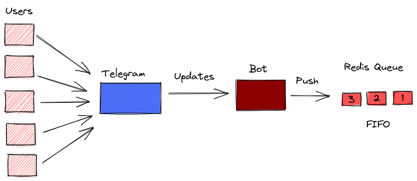

# calvopro-botv2

This repository contains the code related to a Telegram bot made to scrape and download
content from <https://xnxx.com>, is a porn website, so don't click on it if you are at work, just an advice. This bot is the second version of the bot, because the first one was a mess, I made it to learn Go, this one is better, I think. The code need to be cleaned, to eliminate commented code and additional functionalities that are not need it anymore.

## Architecture

Here are two sketch of how things works in a general view.




This repository only contains the code related to the Bot, the code related to the workers is in [calvopro-botv2-worker](https://github.com/Gealber/calvopro-botv2-worker), for more information related to that code just visit that repository and inspect it. I warn you it's written in C, in case you are one of those guys who hate or is afraid of using C, because "C is unsafe and Rust is better and blablabla", just don't. Rust is cool btw, I don't have anything against Rust.

## Limitations

The bot is hosted in Heroku, with a unverified account, which means that there is no credit card associated to the account. For that reason there's a lot of limitations with the performance of the bot, mainly for the sleep mode of dynos in Heroku, but it's free.

Apart from Heroku, there's another great limitation with this bot, and is that it use web scrapping to obtain the information. You may be wondering how is this a limitation, let me explain it to you.

When the user make a query, to obtain the info related to that query, the bot have to visit:

**1 Website to retrieve a list of videos that match with that query**

but all the necessary information cannot be retrieved in that simple HTTP request. Instead,

**for every result in this list**, the bot has to make

**1 HTTP HEAD request**, to get the size of the video

**1 HTTP GET** to visit the video page and retrieve the video URL.

So let's make the math, if the bot returns you 10 results, that means that it made

```bash
TOTAL = 1 + 2 * 10 = 21
```

**21 HTTP requests** that's a lot for a simple query. With an API this would be a single GET request that would retrieve a list of videos information :man_shrugging:.

Even these limitations, the bot perform pretty well, thanks to the magic of Golang and its concurrency model.

### Video size

Telegram's bots can only send videos with less than **50 MB**, so this is another reason why is so important to know before hand the size of the video, to avoid its inclusion on the list in case its size is greater than **50 MB**. This limitation could be avoided, if you deploy your own Telegram bot server, which is possible given that is open source, but I don't have a way to do that, again I'm poor.

### Average time the bot is up

Given that I'm using a free account in Heroku, without a credit card associated to it, I only have 550 hours dyno, which in my experience
with the bot, is around 20 days up.

## Information tracked

The bot just store this information,

1. Telegram user name.
2. Number of times this user name had a session, a session last for 52 minutes, this number is just made up there's no particular reason for this number.

**Nop** I don't store your queries, I just don't care.

### Try it by yourself

The name of the bot is @BusyHandsBot, hit me back with any question or suggestion at <gealber@tutanota.com>.

That's all folks :wave:.
